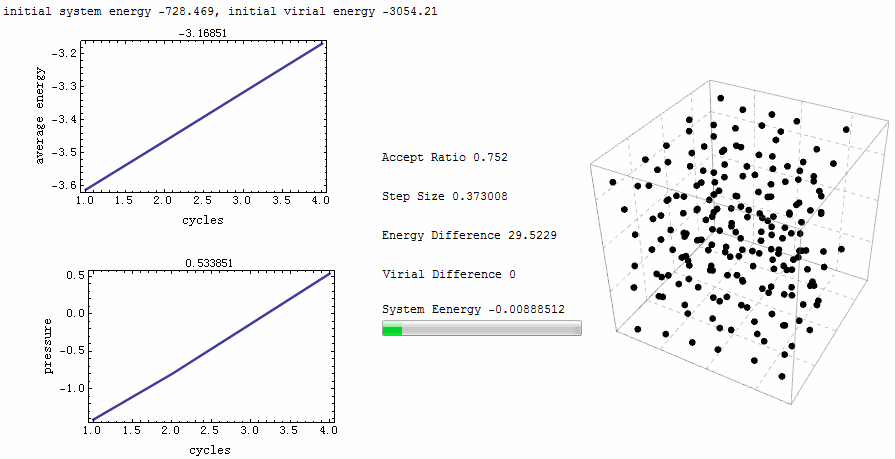

# GCMC_First

Grand Canonical Monte Carlo of Lennard-Jones Fluid Properties

A re-writting of the first case demon code provided by "Understanding Molecular Simulation: From Algorithms to Applications"

[Blog](https://community.wolfram.com/groups/-/m/t/490664?p_p_auth=vcVT09jN)

In the famous book "Understanding Molecular Simulation: From Algorithms to Applications" by D. Frenkel and B. Smit, there is a case study to use Monte Carlo (MC) molecular simulation computing the phase diagram of Lennard-Jones fluid. The results shall be compared with data compiled by Johnson et al [1]. The source code provided with the book, however, can only be compiled under Fortran 77 with Linux command line. With Mathematica at hand, it is tempting to rewrite these code for a more intuitive and flexible viewpoint to the problem.

[1] J. Johnson, J. Zollweg, K. Gubbins, The Lennard-Jones equation of state revisited, Mol. Phys. 78 (1993) 591–618.
